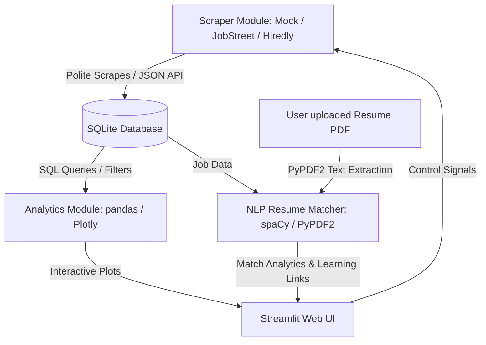

# 🇲🇾 Malaysia Tech Job Market Intelligence Dashboard (TechMarket IQ)

An end-to-end data harvesting, market analytics, and NLP-powered resume matching platform focusing on the technology sectors of Kuala Lumpur and Selangor (including major hubs like Bangsar South, KL Sentral, Cyberjaya, and Mid Valley). 

Designed to empower job seekers with alignment metrics and recruiters with talent matching and competitive local insights.

---

## 🌟 Key Features

1. **Intelligence Hub (Analytics)**
   - **Skill Demand**: Track the top 10 tech skills (Python, React, AWS, Docker, Laravel, SQL, etc.) dynamically.
   - **Hiring Leaderboard**: Discover which companies are posting most actively.
   - **Hiring Timelines**: Time-series charts detailing overall and per-company hiring velocity over time.
   - **Hotspot Heatmap**: Visually locate job concentrations across key Selangor & KL commercial tech hubs (Bangsar South, Cyberjaya, KL Sentral, PJ, etc.) via open-street geocoding.

2. **Job Explorer Engine**
   - Search by job title, company, or skills.
   - Filter by location, min salary threshold, minimum qualification (SPM, STPM, Diploma, Degree, Master, PhD), and preferred university alumni.
   - User-friendly pagination for clean layout browsing.

3. **Smart Resume Matcher (NLP)**
   - Upload text or PDF resumes directly.
   - Extract credentials (academic qualification, languages: English/Malay/Mandarin, technical skill list) using `spaCy` tokenization (with automatic installer and regex fallbacks).
   - Get a compatibility score, matched skills list, missing skills list, and education alignment checks.
   - View recommended upskilling paths linking to free training courses (freeCodeCamp, YouTube, official documentations) for missing skills.

4. **Polite Harvester Admin Console**
   - Control pane to trigger crawling.
   - Integrates user-agent rotation and random request delays (robots.txt friendly).
   - Supports live crawling (Hiredly / JobStreet Malaysia) and a high-fidelity **Simulation Mode** (highly recommended for offline/local demos to bypass Cloudflare rate-limits and captchas).
   - Renders live console logging outputs directly inside the web UI.

5. **"Hire Me" Portfolio Integration**
   - Highlight portfolio, skill matrix, and downloadable 1-page CV placeholder for local CS student developer roles.

---

## 🏗️ Architecture Design



- **Modular Components**:
  - `database/connection.py`: SQLite connection, CRUD functions, index definitions, and stats.
  - `scraper/`: Crawling systems inheriting from `BaseScraper` for rotated agent and request delays.
  - `nlp/resume_processor.py`: PDF reader and spaCy/regex tokenizer parser for skill mapping.
  - `analytics/visualizer.py`: Plotly chart generators and geocoding coordinates.
  - `app.py`: Streamlit main execution script with custom teal glassmorphic styles.

---

## 🛠️ Technology Stack
- **Backend & Logic**: Python 3.9+
- **Frontend / UI**: Streamlit (with custom HSL theme and CSS injection)
- **Database**: SQLite (built-in relational store)
- **Scraping**: BeautifulSoup4, Requests
- **NLP / Parsing**: spaCy (`en_core_web_sm`), PyPDF2
- **Data & Visuals**: Pandas, NumPy, Plotly Express
- **Deployment**: Docker, docker-compose, and environment variables

---

## 🚀 How to Run Locally

### Prerequisites
- Python 3.9 or higher installed.

### Step 1: Clone and Set Up Workspace
Ensure your shell is inside the project directory:
```bash
# Verify files are present
ls malaysia-tech-jobs
```

### Step 2: Install Dependencies
Install Python libraries:
```bash
pip install -r requirements.txt
```
*Note: The NLP processor will try to automatically download the `en_core_web_sm` spaCy model on first run. If offline, it gracefully falls back to a custom regex tokenizer.*

### Step 3: Initialize and Seed Database
Run the database creation script to seed 14 high-quality realistic Malaysian job postings (Grab, Carsome, MoneyLion, Petronas, etc.):
```bash
python db_init.py
```

### Step 4: Run the Streamlit Dashboard
Launch the web interface locally:
```bash
streamlit run app.py
```
Open your browser at: `http://localhost:8501`

---

## 🐳 Running with Docker

Build and execute the application container locally:
```bash
# Build Docker image
docker build -t tech-job-market-iq .

# Run Docker container
docker run -p 8501:8501 tech-job-market-iq
```
Access the dashboard on port `8501`.

---

## 💡 Configuration (`.env`)
Create a `.env` file in the root directory to customize parameters:
```env
DB_PATH=jobs.db
SIMULATE_SCRAPING=True
SCRAPER_DELAY_SECONDS=2
```

---

## 👨‍💻 "Hire Me" CS Student Portfolio

This system features an integrated "Hire Me" dashboard section designed to connect recruiters to **Ahmad Danish**, a final-year Computer Science student at Universiti Malaya (UM) specializing in software engineering and data roles:
- **Core Stack**: Python (FastAPI/Flask), React, PHP (Laravel), SQL, AWS, Docker, Git.
- **Location**: Seeking roles in Kuala Lumpur / Selangor.
- **Contact / CV**: Connected download link for a 1-page resume text and LinkedIn contact cards.
